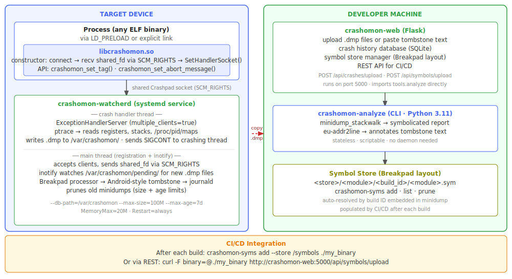

# Crashomon

Crash monitoring for ELF binaries on embedded Linux. Provides Android tombstone-style crash reports, Breakpad minidumps, and a web UI for symbolicated offline analysis — with zero code changes required via `LD_PRELOAD`.



## Components

| Component | Language | Role |
|---|---|---|
| `libcrashomon.so` / `.a` | C++20 (C public API) | LD_PRELOAD crash capture client |
| `crashomon-watcherd` | C++20 | Crashpad handler host, inotify watcher, tombstone formatter, disk manager |
| `crashomon-analyze` | Python 3.11 | CLI symbolication tool |
| `crashomon-syms` | Python 3.11 | Symbol store management |
| `crashomon-web` | Python/Flask | Web UI + REST API |

## Quick start

**1. Build**

```bash
cmake -B build && cmake --build build -j$(nproc)
uv sync
```

**2. Deploy to target**

```bash
install -m 755 build/lib/libcrashomon.so       /usr/lib/
install -m 755 build/daemon/crashomon-watcherd /usr/libexec/crashomon/
cp systemd/crashomon-watcherd.service /etc/systemd/system/
systemctl enable --now crashomon-watcherd
```

**3. Enable crash monitoring for a service** (no code changes)

```bash
mkdir -p /etc/systemd/system/my-service.service.d/
cp systemd/example-app.service.d/crashomon.conf \
   /etc/systemd/system/my-service.service.d/
systemctl daemon-reload && systemctl restart my-service
```

When `my-service` or any of its children crash, a minidump appears in `/var/crashomon/` and a tombstone is written to journald within milliseconds:

```bash
journalctl -u crashomon-watcherd -f
```

## Docs

- **[INSTALL.md](INSTALL.md)** — build options, deployment, cross-compilation, symbol store, crashomon-analyze, web UI
- **[DEVELOP.md](DEVELOP.md)** — directory layout, code standards, formatting, running tests
- **[web/README.md](web/README.md)** — Flask web UI development
